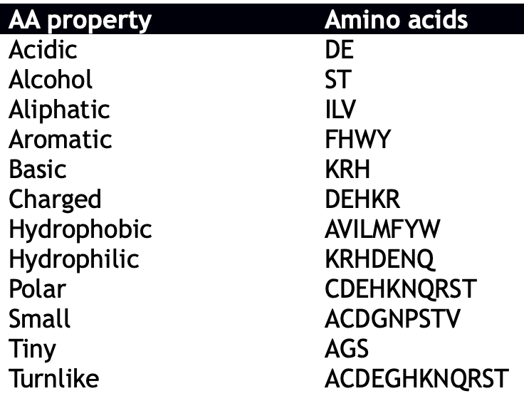

## December 3rd 2018, Monday 13:40 - **December 7th 2018, Friday 14:30**
# `ENS210` Computational Biology, 2018 Fall - Test 2 (Take-home)

### Full Name:       `Batur Gültekin` 
### Student ID:      `24188`
### E-mail address:  `baturgultekin@sabanciuniv.edu`
### `GitHub` Username: `BaturGultekin`

#### Exam Rules

* Any exam-related communication with any of the classmates is **strictly forbidden**.
* You can ask exam-related questions only via [GitHub issues](https://github.com/SUcompBio/ENS210/issues), which will be open to the entire class. Other than that, no question can be asked or e-mailed to the instructor and teaching assistants. This will allow a fair treatment to every student. The questions that you post can be answered by other students taking the exam. Instructor and TAs will try to answer the questions by **December 6th Thursday 2:30pm**. You are encouraged to finish up your exam by that time.
* Do not post any message to GitHub that can give out an answer even if it is partial.
* The codes will be checked for plagiarism with a highly accurate tool. If there is any plagiarism the midterm grade will be zero. Additional disciplinary action will be taken.
* The answers for the questions, datasets, codes and plots should be pushed to your individual `GitHub` repository by the deadline. 
* The deadline is **December 7th Friday 2:30pm**.
* Late work will NOT be accepted for the midterm in any case. You are strongly encouraged to finish up the midterm the day before. There might always be technological problems. It is student's responsibility to submit the answers by the deadline. Broken computer, internet connection problem or any other technical excuses will not be accepted.
* The midterm can be completed in ~6 hours. Unless you have a medical report for the entire week (from Dec 3 to 7), no make-up will be given.
* There will no class and lab in the week of the midterm to leave you more time (extra 5 hours) to work on the tasks.
* Your python codes should work with `Python 3.6`.
* You are free to use the internet and any other resource you will find out. You should note down and push the resources that you benefited in commented out lines in your scripts.
* You should fill in the 5 blanks in this README.md file; four above (your full name, student ID, Sabanci Univ email address and GitHub username), one below (your full name). After you fill in the blanks, commit and push the README.md file immediately to your repository on the day the exam is posted (Dec 4th).


I, `Batur Gültekin`, hereby confirm that I understand and will follow the above exam rules.

Signature (paper-copy only) `______________________`


# Part 1

CpG islands are regions of DNA where a cytosine nucleotide is followed by a guanine nucleotide in the linear sequence of bases along its 5' → 3' direction.

Take a look at the `Gardiner-Garden and Frommer` paper in the repository. Understand how they computed the CpG island methylation in the `Methods` section.

Find and retrieve the DNA sequence of `Homo sapiens proopiomelanocortin` gene from an NCBI gene database. Save the sequence in `proopiomelanocortin.fa`.

## 1.1 Measure CpG profile (25 pts)

Write a python script (`task_1_1.py`) that outputs a file with two tab-separated columns. The first column should be composed of positions and second column should be the computed values for `Obs/Exp CpG` values. The table should have no header. Use the same window length that was used in the paper. Save your table as `proopiomelanocortin_CpG.txt`.

## 1.2 Plot the graph (10 pts)

Use R or Rstudio and ggplot library to generate a **line plot**. The x-axis should be the position and the y-axis should be `Exp/Obs CpG` value. The axes should be labeled accordingly. There should be a horizontal dashed line intercepting at `y=0.6`. Change the theme and color of your plot freely and as you wish so that your plot will be a non-standard and unique one with respect to syle. Save your code in `plots.R`

Save your plot as `task_1_2.png`.

# Part 2

`BRCA2_aligned.fa` is an alignment of BRCA2 genes across organisms. 

## 2.1 Delete columns with a gap in the human protein (15 pts)

We are interested in which position is conserved or not in human BRCA2 sequence. Write a python script that deletes the columns in the alignment which have a `gap` in human BRCA2 sequence (NP_000050.2). The output should be an alignment with no gap in human BRCA2 sequence. There could be gaps in other sequences.

You should write a module (`alignment.py`) including all methods/functions and a main script (`task_2_1.py`) which should call necessary functions from the module. The input and output file names should be used only in the main script `task_2_1.py`. The output alignment should be saved in `brca2_alignment_noHumanGap.fa`.

The output alignment should have the sequences in the same order of the initial alignment.

## 2.2 Consensus sequence (15 pts)

Write functions to return the consensus sequence of an alignment (`brca2_alignment_noHumanGap.fa`). The consensus sequence is determined as the sequence of most common amino acid in each position without considering the gaps.

Your script `task_2_2.py` should output the consensus sequence in `consensus.fa` with header `>BRCA2 consensus sequence`. The functions should be written in `alignment.py` and called from the main script `task_2_2.py`.

## 2.3 Measure and plot identity (15 pts)

Write a function in `task_2_3.py` to measure identity for each consensus position in the alignment (`brca2_alignment_noHumanGap.fa`). When conservation is measured the gaps should not be taken into account. For example:

```
RD
AE
RD
RD
-D
-E
DD
```

The conservation of `R` at the first position is 3/5=0.6 and `D` at the second position is 5/7=0.71. The conservation values should range from 0 to 1.

Write the results in a tab-separated table `identity.txt`. The first and second columns should be position and sequence identity, respectively. The table should have no header. As previous sub-tasks, the functions should be written in the `alignment.py` and called from there.

Use R or Rstudio and ggplot library to generate a **point plot**. The x-axis should be the position and the y-axis should be identity. The axes should be labeled accordingly. Change the theme and color of your plot freely and as you wish so that your plot will be a non-standard and unique one with respect to syle. Save your code in `plots.R` below the previous code from task 1.2.

## 2.4 Measure and plot conservation of a physicochemical property (20 pts)

There are physicochemical properties of amino acids. They can be categorized in several groups (see the table below). In this task, you will measure the conservation of a property. 

Each student will be assigned a property. To get what property is assigned to you run `python3 getMyProperty.py`. You will be asked to enter your student ID. Enter your student ID and press enter to get the property that you are assigned.

Save your table in `PROPERTY.txt`. Change the word PROPERTY with your assigned property (eg `tiny.txt`).  Your script should be saved as `task_2_3.py`. The conservation values should range from 0 to 1. 

Use R or Rstudio and ggplot library to generate a **point plot**. The x-axis should be the position and the y-axis should be conservation value (between 0 and 1). The axes should be labeled accordingly. Save your code in `plots.R` below the previous code from tasks 1.2 and 2.3.




# An important note

Partial credit will be given in all cases. Accurately running code is only a part of points that you will get. The rest will be given to your thinking process and your work which will be reflected in your code. If your code doesn't work for some reason (eg a syntax error etc) you should be searching for an answer online without asking anyone. At the end of the day, even your script doesn't run, it will still be evaluated. If you cannot generate data sets that will be used in `plots.R`, you can make up an imaginary data set to get points from the R code. If your plot code works well on the imaginary dataset as expected, it should work on the real dataset too and therefore you will get points.

## What if you cannot complete on time?

You should push whatever you produced to the GitHub repository by the deadline. Remember that finishing on time is a part of the test. If you cannot answer every task by the deadline, make sure that you push the completed or partial answers, datasets, plots and codes.

# Files to push

* README.md (The blanks should be filled in)
* proopiomelanocortin.fa
* task_1_1.py
* taks_1_2.pdf
* alignment.py
* task_2_1.py
* brca2_alignment_noHumanGap.fa
* consensus.fa
* task_2_2.py
* identity.txt
* task_2_2.png
* task_2_3.py
* task_2_3.png
* PROPERTY.txt (`PROPERTY` will be replaced by the propert that is assigned to you)
* plots.R
